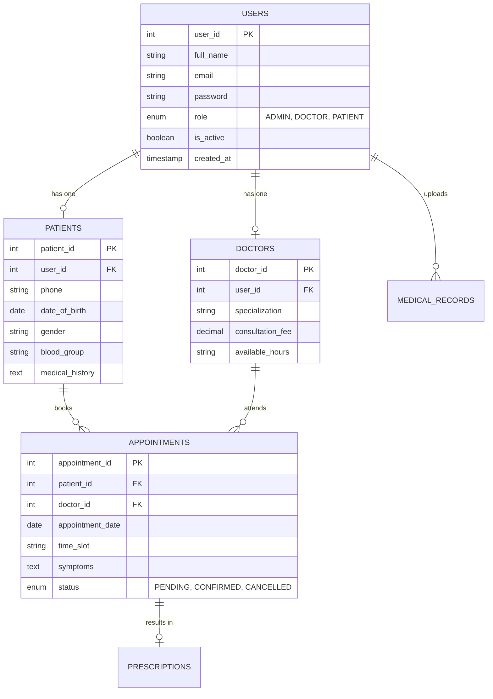

# 🚀 Enterprise Healthcare Workspace Management Engine

A production-grade, highly optimized Model-View-Controller (MVC) enterprise medical ecosystem engineered in Java EE (Servlets & JSP) and backed by a relational MySQL storage engine. This architecture delivers strict Role-Based Access Control (RBAC) boundaries for System Administrators, Medical Doctors, and Registered Patients while processing real-time diagnostic workflows, rule-based clinical chat simulations, secure file streams, and multi-layered administrative audit logging.

## 🏛️ End-to-End Core Enterprise Architecture

The platform is designed around a decoupled, three-tier enterprise pattern ensuring complete Separation of Concerns (SoC) between client presentation interfaces and underlying database data access layers.

```text
         [ BROWSER PRESENTATION TIER ]
         │ (HTML5 / Vanilla ES6 / CSS3 Templates)
         ▼
       [ JSP VIEW TEMPLATING ENGINE ] <─── (Unpacks Dynamic Data Map Payloads)
         │
         │ Asynchronous JSON Requests / Standard HTTP POST Forms
         ▼
     ┌─────────────────────────────────────────────────────────┐
     │                JAKARTA SERVLET CONTROL TIER             │
     ├─────────────────────────────────────────────────────────┤
     │  - Intercepts Incoming Stream Routing & State Requests  │
     │  - Enforces HttpSession Access Authorization Guards     │
     └──────────────────────────┬──────────────────────────────┘
                                │
                                │ Instantiates Core Data Logic Methods
                                ▼
     ┌─────────────────────────────────────────────────────────┐
     │               DATA ACCESS OBJECTS (DAO) LAYER           │
     ├─────────────────────────────────────────────────────────┤
     │  - Direct JDBC API Connectivity (Driver Manager Sockets) │
     │  - Pre-Compiled Parameterized SQL Queries                │
     └──────────────────────────┬──────────────────────────────┘
                                │
                                ▼
                     [ PERSISTENCE TIER: MYSQL ]
```

## ✨ Primary Core Features Across Security Dimensions

### 👤 Patient Experience Engine
* **Context-Aware Scheduling:** Real-time dropdown selection pipelines linked directly to live medical staff databases for seamless time-slot coordination.
* **Diagnostic Telemetry Input:** Patients input acute physical symptoms straight into a text mapping model during booking, immediately available to their treating practitioner.
* **Asynchronous Health Companion:** A rule-based medical dialogue engine returning instant, asynchronous clinical advice using native JavaScript fetch parameters without triggering full page reloads.
* **Secure Document File System:** Patient records (PDF/Images) upload securely to designated local volumes via distinct epoch-prefixed name formatting (`{timestamp}_filename.pdf`) to completely prevent file conflicts.

### 🩺 Clinical Doctor Workspace
* **Unified Practitioner Panel:** Displays clinical case statistics, upcoming schedules, and embedded boxes for reviewing patient symptoms.
* **State Management Interface:** Streamlined forms to accept or decline appointment requests, triggering instant database status switches.
* **Prescription Generation System:** Secure sub-interfaces to log clinical diagnoses and prescribe medications directly tied to appointment IDs.

### 🛠️ System Administration Portal
* **Left-Join Directory Grids:** Utilizes SQL left outer join queries to display unified user profiles alongside doctor specialization records.
* **Dynamic Profile Provisioning:** Empowers administrators to allocate clinical attributes (fees, specialization matrices) to new medical user profiles.
* **Immutable Security Guard Rails:** Instant system-wide user suspension toggles (`is_active`) and total record purges.
* **Audit Logging & System Config:** Employs high-performance `ON DUPLICATE KEY UPDATE` commands for platform settings, backed by an automated audit table tracking all admin modifications.

## 📂 System File Hierarchy & Directory Structure

```text
healthcare-workspace-system/
│
├── src/main/java/com/healthcare/
│   ├── model/                  # Plain Old Java Objects (POJOs) defining core schemas
│   │   ├── User.java
│   │   └── Appointment.java
│   │
│   ├── controller/             # Jakarta HttpServlet Request Traffic Routers
│   │   ├── LoginServlet.java
│   │   ├── AppointmentServlet.java
│   │   ├── ChatbotServlet.java
│   │   └── UploadRecordServlet.java
│   │
│   ├── dao/                    # Data Access Interfaces & Explicit SQL Drivers
│   │   ├── DBConnection.java   # Centralized JDBC SQL Socket Manager
│   │   ├── DoctorDAO.java
│   │   └── AdminDAO.java
│   
├── src/main/webapp/            # Dynamic Web Interface Files (Views Layer)
│   ├── WEB-INF/
│   │   └── web.xml             # Deployment Descriptor Configuration
│   ├── uploads/                # Secure local disk storage volume for records
│   ├── login.jsp               # Base Authentication Portal
│   ├── patient-dashboard.jsp
│   ├── doctor-dashboard.jsp
│   └── admin-dashboard.jsp
```

## 🧬 Relational Database Relational Schema Layout



The database layout maps identity records using separate tables linked by structural foreign keys:

```sql
-- 1. Master Authentication & User Identity Table
CREATE TABLE users (
    user_id INT AUTO_INCREMENT PRIMARY KEY,
    full_name VARCHAR(100) NOT NULL,
    email VARCHAR(100) UNIQUE NOT NULL,
    password VARCHAR(255) NOT NULL,
    role ENUM('ADMIN', 'DOCTOR', 'PATIENT') NOT NULL,
    is_active BOOLEAN DEFAULT TRUE,
    created_at TIMESTAMP DEFAULT CURRENT_TIMESTAMP
);

-- 2. Medical Practitioners Profile Extension
CREATE TABLE doctors (
    doctor_id INT AUTO_INCREMENT PRIMARY KEY,
    user_id INT,
    specialization VARCHAR(100),
    consultation_fee DECIMAL(10,2),
    available_hours VARCHAR(50),
    FOREIGN KEY (user_id) REFERENCES users(user_id) ON DELETE CASCADE
);

-- 3. Patient Consumer Profile Extension
CREATE TABLE patients (
    patient_id INT AUTO_INCREMENT PRIMARY KEY,
    user_id INT,
    FOREIGN KEY (user_id) REFERENCES users(user_id) ON DELETE CASCADE
);

-- 4. Central Appointment Transaction Matrix
CREATE TABLE appointments (
    appointment_id INT AUTO_INCREMENT PRIMARY KEY,
    patient_id INT,
    doctor_id INT,
    appointment_date DATETIME NOT NULL,
    time_slot VARCHAR(20) NOT NULL,
    symptoms TEXT,
    status ENUM('PENDING', 'CONFIRMED', 'CANCELLED') DEFAULT 'PENDING',
    FOREIGN KEY (patient_id) REFERENCES patients(patient_id),
    FOREIGN KEY (doctor_id) REFERENCES doctors(doctor_id)
);

-- 5. Prescriptions Resolution Table
CREATE TABLE prescriptions (
    prescription_id INT AUTO_INCREMENT PRIMARY KEY,
    appointment_id INT,
    diagnosis TEXT,
    doctor_notes TEXT,
    prescribed_medicines TEXT,
    FOREIGN KEY (appointment_id) REFERENCES appointments(appointment_id) ON DELETE CASCADE
);

-- 6. Audit Logging Table
CREATE TABLE audit_logs (
    id INT AUTO_INCREMENT PRIMARY KEY,
    actor VARCHAR(100),
    action VARCHAR(100),
    details TEXT,
    timestamp TIMESTAMP DEFAULT CURRENT_TIMESTAMP
);
```

## 🛠️ Technology Stack Rationale

* **Core Java Servlets (Jakarta API):** Chosen over frameworks to gain foundational mastery of raw web HTTP streams, request/response cycles, and stateful tracking.
* **Raw JDBC Operations:** Leverages native SQL structures wrapped inside pre-compiled execution elements (`PreparedStatement`). This approach avoids heavy Object-Relational Mapping (ORM) framework overhead, preserves absolute performance control, and completely prevents SQL injection vulnerabilities.
* **Lightweight JSP Rendering Engine:** Combines server-side templating scriptlets to serve optimized HTML documents down to the browser client without requiring heavy frontend bundles.

## 🚀 Local Deployment Instructions

### Prerequisites
* Java Development Kit (JDK 8 or JDK 11+) installed.
* Apache Tomcat Server (v9.0 or higher) configured.
* MySQL Database Server instance running.

### 1. Database Initialization
Log into your local MySQL instance and run the initialization schema script:
```bash
mysql -u root -p < src/main/resources/schema.sql
```

### 2. Configure Your Environment Connection
Navigate to `src/main/java/com/healthcare/dao/DBConnection.java` and adjust your local server parameters:
```java
private static final String URL = "jdbc:mysql://localhost:3306/healthcare_db";
private static final String USER = "YOUR_DATABASE_USERNAME";
private static final String PASSWORD = "YOUR_DATABASE_PASSWORD";
```

### 3. Application Packaging and Tomcat Boot
1. Compile your Java classes and package your project as a `.war` file distribution using your local development workspace.
2. Drop the compiled `.war` file directly into your Apache Tomcat container's `/webapps` directory.
3. Boot up the server instance via terminal control:
```bash
./catalina.sh start
```
4. Access the web deployment by navigating directly to your local address:
`http://localhost:8080/healthcare-workspace-system/`
